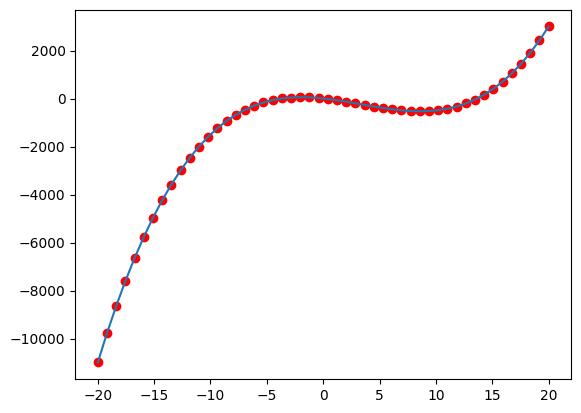

# Introducción a NumPy

NumPy es una **librería** fundamental para el cálculo numérico en Python. Proporciona soporte para crear y manipular **arrays** y **matrices** multidimensionales de manera eficiente, además de una amplia colección de funciones matemáticas para operar con estos objetos.

## Instalación y Importación

Para instalar NumPy, puedes utilizar `pip`:

```bash
pip install numpy
```

Una vez instalada, se importa comúnmente con el alias `np`:

```python
import numpy as np
```

## Utilidad de NumPy

NumPy es esencial para aplicaciones que requieren operaciones matemáticas y estadísticas de alto rendimiento, como análisis de datos, aprendizaje automático y procesamiento de imágenes. Sus arrays son más eficientes en términos de memoria y velocidad que las listas de Python para operaciones numéricas.

## Creación de Arrays y Matrices

### A partir de listas

Puedes crear un **array** unidimensional a partir de una lista:

```python
lista = [1, 2, 3, 4, 5]
array = np.array(lista)
print(array)
#>  [1 2 3 4 5]
```

Para crear una **matriz** (array bidimensional), utilizas una lista de listas:

```python
lista_de_listas = [[1, 2], [3, 4]]
matriz = np.array(lista_de_listas)
print(matriz)
#> 
# [[1 2]
#  [3 4]]
```

### Arrays Multidimensionales

#### Con ceros, unos o valores arbitrarios

- **Array de ceros**:

  ```python
  ceros = np.zeros((2, 3))
  print(ceros)
  #> 
  # [[0. 0. 0.]
  #  [0. 0. 0.]]
  ```

- **Array de unos**:

  ```python
  unos = np.ones((3, 2))
  print(unos)
  #> 
  # [[1. 1.]
  #  [1. 1.]
  #  [1. 1.]]
  ```

- **Array con un valor arbitrario**:

  ```python
  valor_arbitrario = np.full((2, 2), 7)
  print(valor_arbitrario)
  #> 
  # [[7 7]
  #  [7 7]]
  ```

#### Matrices con valores aleatorios

- **Valores aleatorios entre 0 y 1**:

  ```python
  aleatorios = np.random.random((2, 2))
  print(aleatorios)
  #> 
  # [[0.5488135  0.71518937]
  #  [0.60276338 0.54488318]]
  ```

- **Valores aleatorios enteros**:

  ```python
  aleatorios_enteros = np.random.randint(1, 10, size=(2, 3))
  print(aleatorios_enteros)
  #> 
  # [[3 7 9]
  #  [2 7 8]]
  ```

## Operaciones Numéricas con Matrices

### Operaciones entre Matrices

```python
a = np.array([[1, 2], [3, 4]])
b = np.array([[5, 6], [7, 8]])

suma = a + b
resta = a - b
producto = a * b  # Producto elemento a elemento
producto_matricial = np.dot(a, b)

print("Suma:\n", suma)
#> 
# [[ 6  8]
#  [10 12]]
print("Resta:\n", resta)
#> 
# [[-4 -4]
#  [-4 -4]]

print("Producto elemento a elemento:\n", producto)
#> 
# [[ 5 12]
#  [21 32]]
print("Producto matricial:\n", producto_matricial)
#> 
# [[19 22]
#  [43 50]]

```

### Operaciones con Valores Numéricos

```python
escalar = 2
multiplicacion = a * escalar
division = a / escalar

print("Multiplicación por escalar:\n", multiplicacion)
#> 
# [[2 4]
#  [6 8]]

print("División por escalar:\n", division)
#> 
# [[0.5 1. ]
#  [1.5 2. ]]
```

## Funciones Estadísticas y Procesamiento

```python
matriz = np.array([[1, 2, 3], [4, 5, 6]])

print("Máximo:", matriz.max())
#> Máximo: 6
print("Mínimo:", matriz.min())
#> Mínimo: 1
print("Media:", matriz.mean())
#> Media: 3.5
print("Desviación estándar:", matriz.std())
#> Desviación estándar: 1.707825127659933

print("Suma por columnas:", matriz.sum(axis=0))
#> Suma por columnas: [5 7 9]
print("Suma por filas:", matriz.sum(axis=1))
#> Suma por filas: [ 6 15]
```

## Acceso y Manipulación de Elementos

### Acceder a Elementos y Slices

```python
array = np.array([1, 2, 3, 4, 5])

print("Elemento en posición 2:", array[2])
#> Elemento en posición 2: 3
print("Slice de posición 1 a 3:", array[1:4])
#> Slice de posición 1 a 3: [2 3 4]

matriz = np.array([[1, 2, 3], [4, 5, 6], [7, 8, 9]])
print(matriz)
#> 
# [[1 2 3]
#  [4 5 6]
#  [7 8 9]]

print("Elemento en posición (1, 2):", matriz[1, 2])
#> Elemento en posición (1, 2): 6

print("Slice de filas 0 y 1, columnas 1 y 2:\n", matriz[:2, 1:])
#> Slice de filas 0 y 1, columnas 1 y 2:
#> [[2 3]
#>  [5 6]]

print("Esquina inferior derecha:\n", matriz[-2:, -2:])
#> Esquina inferior derecha:
#> [[5 6]
#>  [8 9]]

```

### Cambiar Elementos y Slices

Cuando usamo un slice del lado izquierdo de una asignacion podemos modificar los valores de los elementos seleccionados.

```python
matriz = np.array([[1, 2, 3], [4, 5, 6], [7, 8, 9]])

print("Matriz original:\n", matriz)
#> Matriz original:
# [[1 2 3]
# [4 5 6]
# [7 8 9]]

# Modificar un elemento
matriz[1, 2] = 100
print("Matriz modificada:\n", matriz)
#> Matriz modificada:
# [[  1   2   3]
#  [  4   5 100]
#  [  7   8   9]]

# Modificar una fila 
matriz[0] = [10, 20, 30]
print("Matriz con la primera fila modificada:\n", matriz)
#> Matriz con la primera fila modificada:
# [[10 20  30]
#  [ 4  5 100]
#  [ 7  8  9]]

# Modificar una columna
matriz[:, 1] = [40, 50, 60]
print("Matriz con la segunda columna modificada:\n", matriz)
#> Matriz con la segunda columna modificada:
# [[10 40  30]
#  [ 4 50 100]
#  [ 7 60  9]]

# Modificando todos juntos
matriz[:, 1] = 200
print("Matriz con la segunda columna modificada:\n", matriz)
#> Matriz con la segunda columna modificada:
# [[ 10 200  30]
#  [  4 200 100]
#  [  7 200   9]]

# Modificando un slice
matriz[1:, 1:] = 300
print("Matriz con la esquina inferior derecha modificada:\n", matriz)
#> Matriz con la esquina inferior derecha modificada:
# [[ 10 200  30]
#  [  4 300 300]
#  [  7 300 300]]
```

### Cambio de forma de una matriz (Reshape)

Los datos en una matriz de almacena en forma secuencial pero se acceden con indices de dos dimensiones. Podemos cambiar la forma de una matriz sin cambiar los datos que contiene.


```python
### Reshape

original = np.array([1, 2, 3, 4, 5, 6, 7, 8])
print("Array original:\n", original)
#> Array original:
#> [1 2 3 4 5 6 7 8]
print("Dimensiones del array original:", original.shape)
#> Dimensiones del array original: (8,)

reacomodado = original.reshape(2, 4)

print("Array reacomodado:\n", reacomodado)
#> Array reacomodado:
#> [[1 2 3 4]
#>  [5 6 7 8]]
print("Dimensiones del array reacomodado:", reacomodado.shape)
#> Dimensiones del array reacomodado: (2, 4)

reasignado = original.reshape(4, 2)
print("Array reasignado:\n", reasignado)
#> Array reasignado:
#> [[1 2]
#>  [3 4]
#>  [5 6]
#>  [7 8]]


d1 = original.reshape(8)
print("Array 1D:\n", d1)
#> Array 1D:
#> [1 2 3 4 5 6 7 8]

d2 = original.reshape(2, 4)
print("Array 2D:\n", d2)
#> Array 2D:
#> [[1 2 3 4]
#>  [5 6 7 8]]

d3 = original.reshape(2, 2, 2)
print("Array 3D:\n", d3)
#> Array 3D:
#> [[[1 2]
#>   [3 4]]
#>  
#>  [[5 6]
#>   [7 8]]]

d4 = original.reshape(2,2,2,1)
print("Array 4D:\n", d4)
#> Array 4D:
#> [[[[1]
#>    [2]]
#>
#>   [[3]
#>    [4]]]
#>
#>  [[[5]
#>    [6]]
#>
#>   [[7]
#>    [8]]]]
```

### Modificar Matrices

```python
matriz = np.array([[1, 2], [3, 4]])
matriz[0, 1] = 20
print("Matriz modificada:\n", matriz)
```

## Filtrado con Condiciones

### Crear Matrices con Condiciones

```python
array = np.arange(10).reshape(2, 5)
print("Array original:\n", array)
#> Array original:
#> [[0 1 2 3 4]
#>  [5 6 7 8 9]]

condicion = array > 3 * array < 8
print("Condición array > 3 y < 8:\n", condicion)
#> Condición array > 3 y < 8: 
#> [[False False False False  True]
# [ True  True  True False False]]  

array[condicion] = 0
print("Array modificado:\n", array)
#> Array modificado:
#> [[0 1 2 3 0]
#>  [0 0 0 8 9]]


print(a[condicion])
#> [4 5 6 7]

pares = array % 2 == 0
print("Elementos pares:", pares)
#> Elementos pares: 
#> [[ True False  True False  True]

print(array[pares])
#> [0 2 0 0 8]
```
## Graficar Funciones con NumPy

### Generar y Graficar una Función Cuadrática

```python
import matplotlib.pyplot as plt

x = np.linspace(-10, 10, 100)
y = x**2

plt.plot(x, y)
plt.title("Función Cuadrática")
plt.xlabel("x")
plt.ylabel("y")
plt.show()
```

## Ajuste de Polinomios

### Generar Datos y Agregar Ruido

```python
np.random.seed(0)
x = np.linspace(-10, 10, 50)
y = x**2 + np.random.normal(0, 10, size=x.size)

plt.scatter(x, y, label="Datos con ruido")
```

### Usar `polyfit` para Ajuste

```python
∑```

## Procesamiento de Imágenes

### Cargar una Imagen PNG en un Array

```python
from matplotlib.image import imread

imagen = imread('imagen.png')
print("Dimensiones de la imagen:", imagen.shape)
#> Dimensiones de la imagen: (512, 512, 4)
```

### Graficar los Cuatro Canales

```python
fig, axs = plt.subplots(1, 4, figsize=(15, 5))

canales = ['Rojo', 'Verde', 'Azul', 'Alpha']
for i in range(4):
    axs[i].imshow(imagen[:, :, i], cmap='gray')
    axs[i].set_title(f'Canal {canales[i]}')
    axs[i].axis('off')

plt.show()
```

### Modificar los Canales

#### Modificar el Canal Rojo

```python
import numpy as np

alto, ancho, _  = imagen.shape
centro_alto     = alto // 2
centro_ancho    = ancho // 2
tamaño_cuadrado = 50

imagen_modificada = imagen.copy()
imagen_modificada[centro_alto - tamaño_cuadrado:centro_alto + tamaño_cuadrado,
                  centro_ancho - tamaño_cuadrado:centro_ancho + tamaño_cuadrado, 0] = 255
```

#### Modificar el Canal Verde

```python
imagen_modificada[0:tamaño_cuadrado * 2, centro_ancho - tamaño_cuadrado:centro_ancho + tamaño_cuadrado, 1] = 255
```

### Graficar los Canales Modificados

```python
fig, axs = plt.subplots(1, 4, figsize=(15, 5))

for i in range(4):
    axs[i].imshow(imagen_modificada[:, :, i], cmap='gray')
    axs[i].set_title(f'Canal {canales[i]} Modificado')
    axs[i].axis('off')

plt.show()
```

# Conclusión

NumPy es una herramienta poderosa para el manejo eficiente de datos numéricos en Python. Su integración con otras librerías como Matplotlib amplía sus capacidades para análisis y visualización de datos, convirtiéndolo en un recurso indispensable para científicos de datos y desarrolladores.